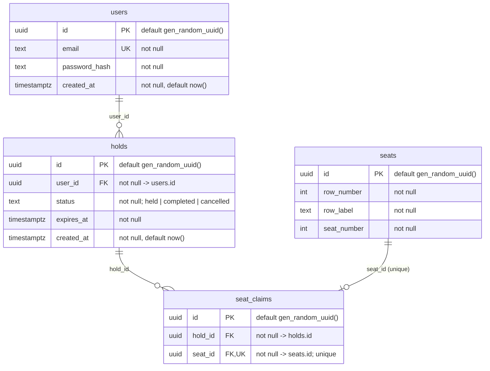

# ERD

Generated from `database/migrations/*.sql` — regenerate when a migration changes, never edit by memory. Why the tables look like this: [ARCHITECTURE §6](ARCHITECTURE.md#6-data-model).

Indexes and constraints not drawn above:

| Table | Name | Definition | Source |
|---|---|---|---|
| `holds` | `holds_one_held_per_user` | `UNIQUE (user_id) WHERE status = 'held'` — one active hold per user (ARCHITECTURE §4) | `1790208000000_cinema_create-seats-holds-seat-claims.sql` |
| `holds` | check | `status IN ('held', 'completed', 'cancelled')` | same |
| `seat_claims` | `seat_claims_hold_id` | `INDEX (hold_id)` | same |
| `seats` | unique | `UNIQUE (row_number, seat_number)` | same |

Ownership: `auth` owns `users`; `cinema` owns `seats`, `holds`, `seat_claims`.
